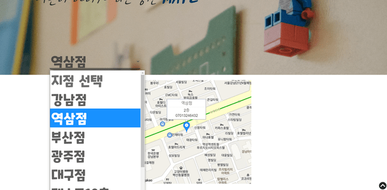
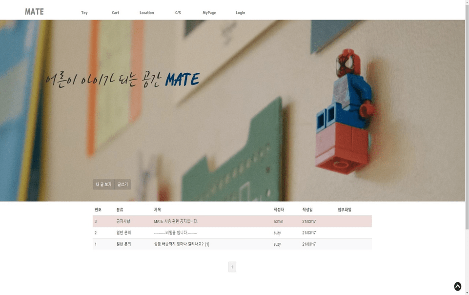
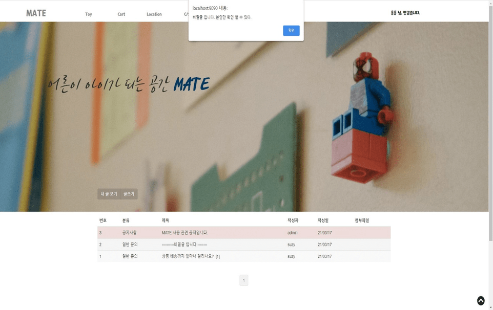

# 프로젝트명
MATE (Market Adult Toy ERP)

## 개요
- 어른 장난감 대한 구매, 지점, 판매 매출 정보 등을 관리하는 ERP 서비스
- Spring Framework를  이용한  쇼핑몰 + ERP 사이트

## 수행 기간

2020년 09월 ~ 2020년 11월

## 개발 환경

> **OS :** Windows 10 
> **WAS :** Apache Tomcat 8.5 
> **Dababase :** Oracle 11g 
> **Language :** Java, HTML5, CSS3, JavaScript, SQL 
> **IDE :** Spring Tool Suite 4, SQL Developer

## 핵심 기능

- 메인 페이지 Best 5 상품 출력
- 상품 구매 예약이 가능한 장바구니 기능 제공
- 구매자들의 배송지 관리 기능
- 구매내역 확인 및 상품 환불, 교환 기능
- 지점별 매출/입출고/재고/발주 관리 기능
- ERP게시판을 통한 지점 간의 상품 교환 기능
- 유저의 각종 문의 및 건의에 대한 답변 게시판 및 공지사항 게시판 제공
- Open API를 사용한 로그인, 결제, 매장 위치확인, 상품 정보 입력, 핸드폰 인증 기능
(kakao login, kakao map, daum 주소, naver login, ckeditor, coolsms, iamport 사용)

### 주요 화면 소개

  
  
  
  
  
  
  
  

### 테이블 설계
  
